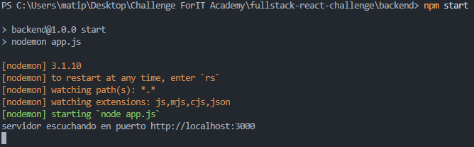
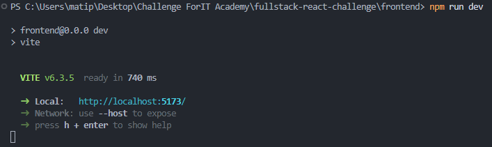
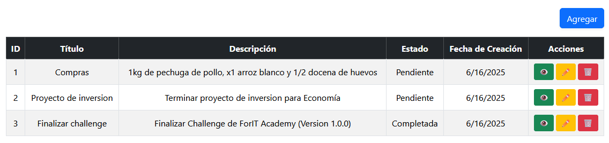

# fullstack-react-challenge
---

## Realización

La aplicación (como se muestra en el Boceto UI) fue realizado en dos etapas:

1. Backend

    Cuenta con su propia carpeta, en donde se llevó a cabo la inicialización de la base de datos en sqlite, además se planteó el modelo de las **tasks** con un ORM llamado sequelize para facilitar el trabajo con objetos y ahorrarnos la manipulación directa con la base de datos (lo hace directamente sequelize). 

    Además se llevo a cabo la creación de la API y el enrutamiento mediante express.js.

2. Frontend

    Cuenta con su propia carpeta, en donde se llevó a cabo la interacción con los
endpoints correspondientes a la API creada en el backend. 

    Se utilizó React, junto a la herramienta Vite para inicializar el proyecto.
Además se trabajó con Axios para realizar llamadas HTTP a los endpoints a medida que fue necesario.

    Por otro lado, se llevó a cabo el enrutamiento, como fue solicitado en el 
enunciado del challenge, mediante la librería react-router-dom.

    Para el formulario (de creación/edición) se utilizó tambien una librería 
llamada react-hook-form que nos facilita y simplifica mucho la manipulación de 
los campos del formulario mediante el hook useForm().

## Instrucciones de uso

Para llevar a cabo el uso del proyecto, debes realizar los siguientes pasos:

1. Una vez abierta la terminal, posicionate en ```'/fullstack-react-challenge/backend/'``` y ejecuta el siguiente comando para inicializar el servidor: 

    ```
    npm start
    ```

    * Deberia verse algo como:
    
    

2. Luego vuelve al directorio anterior y muevete nuevamente, pero ahora hacia ```'/fullstack-react-challenge/frontend'``` y ejecuta el siguiente comando para inicializar la aplicación React:

    ```
    npm run dev
    ```

    * Debería verse algo como:

    

3. Abre un navegador en local (la computadora donde ejecutaste los pasos anteriores) y dirigete a la siguiente URL: ```http://localhost:5173/```. Deberías ver algo como:

    

Listo, ahora solo queda interactuar con la aplicación. 

Puedes realizar consultas, consultas de cada tarea para ver su detalle, creación, actualización y eliminación de las mismas. Todas aquellas acciones correspondientes al conjunto ABMC (Alta-baja-modificación-consulta) o también llamado CRUD.